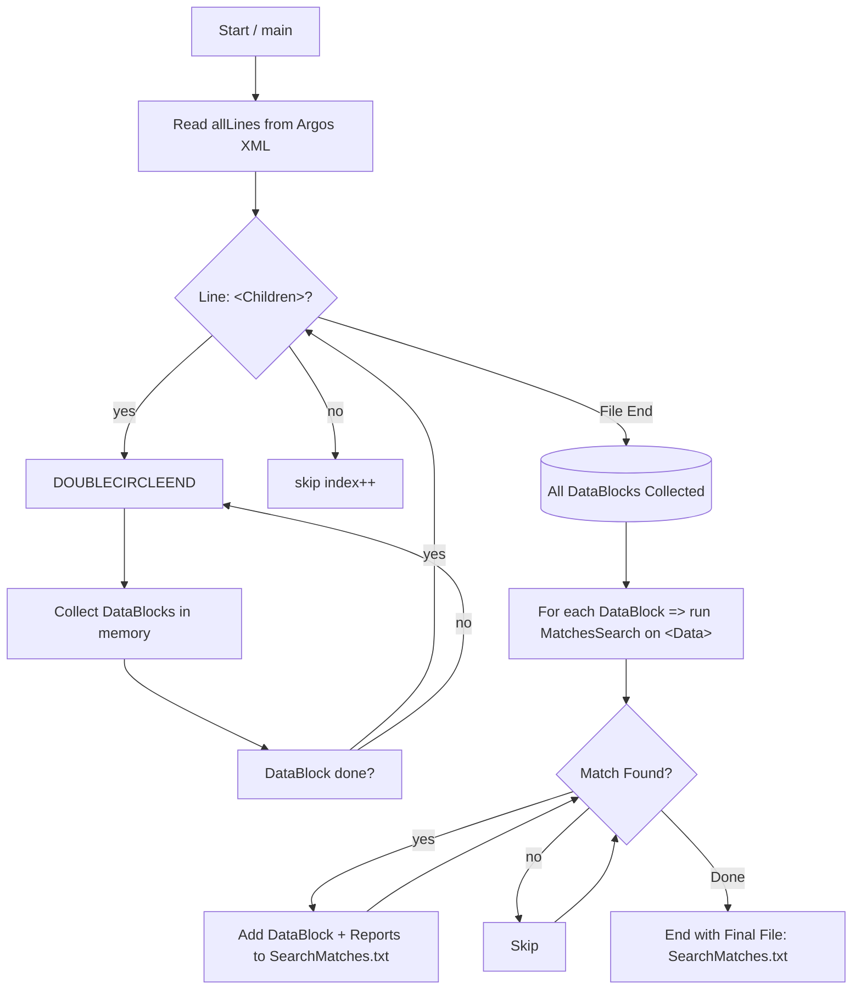

# Argos XML Parsing & DataBlock Filtering

This repository contains a **single-phase** Argos XML parser that identifies **DataBlocks** (with optional `<Data>` content) and **Reports** (child elements), extracts relevant lines for filtering, and only includes results for DataBlocks whose `<Data>` content (minus lines starting with `<`/`&lt;`) actually matches specified search terms (like `"SSN"`).

## Table of Contents

- [Overview](#overview)
- [Features](#features)
- [Structure & Flow](#structure--flow)
- [Usage](#usage)
- [Example Search Flow](#example-search-flow)
- [Implementation Details](#implementation-details)
- [Mermaid Diagram](#mermaid-diagram)
- [Customization](#customization)
- [License](#license)

---

## Overview

**Argos** exports can be quite large and contain nested `<Children>`, `<DataBlock>`, `<Report>`, and more. This solution:

1. **Parses** a top-level `<Children>` element (and recursively any nested `<Children>`).
2. **Discovers** each `<DataBlock>` and reads its **`<Data>`** content, converting it to lowercase for case-insensitive filtering.
3. **Skips** lines that begin with `<` or `&lt;` (to avoid false matches in XML tags) when searching for user-provided terms (e.g., `"SSN"`, `"SocialSecurity"`).
4. **Associates** any `<Report Name="..." />` elements found **inside** that DataBlock's `<Children>` scope with the DataBlock.
5. **Creates** a single file called `SearchMatches.txt` that only includes DataBlocks whose `<Data>` lines actually reference any of the user’s search terms. Under each DataBlock, it lists the **Reports** that belong to it.

This approach avoids the problem of repeating the same reports for multiple DataBlocks, ensures lines inside XML tags don’t cause false positives, and produces a minimal, succinct final text file highlighting only the relevant results.

---

## Features

- **Single-phase** parse: direct recursion through `<Children>` blocks.
- **Case-insensitive** search: the solution stores `<Data>` text in lowercase.
- **Skips** lines that begin with `<` or `&lt;`, preventing tags like `<Condition>SSN</Condition>` from matching.
- **DataBlock name** recognized from:
  1. `Name="..."` attribute on `<DataBlock>`
  2. `<Name>Sub-element</Name>` if the attribute is missing or says `"Main"`.
  3. Fallback to `UnnamedDataBlock_#` if no valid name is found.
- **Search** any substring. If a line in `<Data>` contains your search term, that DataBlock is included in `SearchMatches.txt`.
- **Assocates** `<Report>` elements only if they appear within the same `<Children>` scope as the DataBlock.

---

## Structure & Flow

The parser’s top-level function:

1. **Reads** the entire Argos export file into memory (`allLines`).
2. **Finds** top-level `<Children>` tags and calls `ParseChildren(...)`.
3. `ParseChildren` scans for `<DataBlock>`, `<Report>`, or nested `<Children>`:
   - If `<DataBlock>`: calls `ParseDataBlock` to gather `<Name>`, `<Data>` content.
   - If `<Report>`: links it to the current `DataBlockNode` (if any).
4. Each `DataBlockNode` is stored in a list, eventually processed for matching.

When the parser is complete, it runs a **search** on each `DataBlockNode`’s `<Data>` text. Matching lines:

- Are checked only if they **don’t** start with `<`/`&lt;`.
- Substring checks are done in lowercase to accommodate different letter casing.

Finally, it writes out `SearchMatches.txt`, listing only the matched DataBlocks with their child reports.

---

## Usage

1. **Compile** the C# code (for example using `csc ArgosChildrenParser.cs` or a .NET project).
2. **Run** the resulting executable:
   ```bash
   ArgosChildrenParser.exe MyArgosExport.xml "SSN, SocialSecurity, AnotherTerm"
   ```
3. This will create:
   - `SearchMatches.txt` in the current folder with the matched DataBlocks and associated Reports.

**No other** output is produced, though the code prints `[DEBUG]` messages to the console to help follow the parse logic.

---

## Example Search Flow

Consider an Argos export snippet like this:

```xml
<Children>
  <DataBlock Name="Main">
    <Name>Employee Deductions</Name>
    <Data>
      SELECT ... from EMPLOYEE_TABLE
      SSN_Details some text
      <Condition>Ignore me</Condition>
    </Data>
    <Children>
      <Report Name="EmpDedReport" />
      <Report Name="AnotherReport" />
    </Children>
  </DataBlock>
</Children>
```

- The code sees `<DataBlock>` → `Name="Main"` but also sees `<Name>Employee Deductions</Name>`, so it sets the block’s name to `"Employee Deductions"` (overriding `Main`).
- Reads all lines within `<Data>` into lowercase.  
  - Lines that **begin** with `<` or `&lt;` (like `<Condition>Ignore me</Condition>`) will be **skipped** for searching.  
  - The line containing `"SSN_Details some text"` is **not** skipped and thus can match `"ssn"` or `"SSN"`.
- `<Report Name="EmpDedReport" />` is linked to this DataBlock.
- If `ssn` is part of the search, the line with `"SSN_Details"` triggers a match.  
- `SearchMatches.txt` will list:

```
DataBlock: Employee Deductions
Reports:
  - EmpDedReport
  - AnotherReport
```

---

## Implementation Details

### `ParseChildren`
- Recursively processes `<Children>...</Children>` blocks.
- Within each `<Children>` block, it can see `<DataBlock>`, `<Report>`, or nested `<Children>`.
- `<DataBlock>` triggers a call to `ParseDataBlock` to read its content.  
- `<Report>` is attached to the **current** `DataBlockNode` if one is indicated in the parameters (i.e., if we’re inside that block’s `<Children>`).

### `ParseDataBlock`
- Reads potential `Name="..."` from the `<DataBlock ...>` line.
- Checks for `<Name>...</Name>` sub-element to override if `Name` says `Main` or is empty.
- Gathers `<Data>` lines (converted to lowercase). The search logic will skip lines starting with `<` or `&lt;`.

### `ParseReport`
- Reads lines until `</Report>` is found.
- If the `<Report ...>` has a `Name="..."` attribute, we store it. Otherwise `(Unnamed Report)`.

### `MatchesSearch`
- Splits the stored, **already-lowercase** data by newlines.
- For each line:
  - If it starts with `<` or `&lt;`, skip it.
  - Else, check if it contains **any** user-provided term (also lowercased).
- Returns `true` on the **first** match, `false` if no match is found.

---

## Diagram



**Explanation**:  
1. **Start** reads `allLines`.  
2. It **loops** until end of file, checking if line is `<Children>` or not.  
3. **ParseChildren** finds `<DataBlock>` or `<Report>` or more `<Children>` recursively.  
4. Storing them in memory (a list of `DataBlockNode`).  
5. **Search**: each DataBlock’s `<Data>` lines are checked for user terms (skipping `<...>` lines).  
6. If matched, we write the block name + child reports to `SearchMatches.txt`.  
7. End.

---

## Customization

- **Lines Skipping**: If you also need to skip lines starting with `--`, `/*`, or others, adapt the code in `MatchesSearch`.
- **Name Logic**: If your `<DataBlock>` doesn’t use `<Name>` but uses `<Title>` or `Name="XYZ"` differently, adjust `ParseDataBlock`.
- **Case-Insensitive** or partial matches: The code does partial substring matching. If you need exact words (e.g. `\bSSN\b`), use a regex approach.
- **Output**: We produce `SearchMatches.txt`, but you can easily produce JSON, CSV, or other formats.

---

## License

You can include a license statement here (e.g. MIT, Apache 2.0) if you’d like. Example:

```
MIT License
Copyright ...
Permission is hereby granted...
```

---

**Enjoy** your Argos data-block parsing and searching! If you have any issues or enhancements, feel free to open a pull request or file an issue in this repository.
