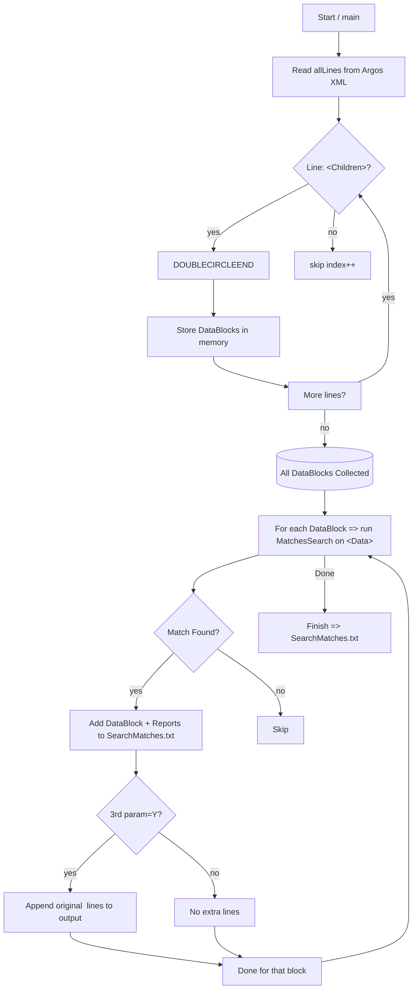

# Argos XML Parsing & DataBlock Filtering

This repository contains a **single-phase** Argos XML parser that identifies **DataBlocks** (with optional `<Data>` content) and **Reports** (child elements), extracts relevant lines for filtering, and only includes results for DataBlocks whose `<Data>` content (minus lines starting with `<`/`&lt;`) actually matches specified search terms (like `"SSN"`).

When an **optional third parameter** is set to `Y`, the parser will also **append** the **original `<Data>` lines** at the bottom of each **matched** DataBlock in `SearchMatches.txt`. This can help you see the actual SQL or text lines inside `<Data>` (even if they start with `<` and were skipped in the filtering logic).

## Table of Contents

- [Overview](#overview)
- [Features](#features)
- [Structure & Flow](#structure--flow)
- [Usage](#usage)
- [Example Search Flow](#example-search-flow)
- [Implementation Details](#implementation-details)
- [Mermaid Diagram](#mermaid-diagram)
- [Customization](#customization)
- [License](#license)

---

## Overview

**Argos** exports can be quite large and contain nested `<Children>`, `<DataBlock>`, `<Report>`, and more. This solution:

1. **Parses** a top-level `<Children>` element (and recursively any nested `<Children>`).
2. **Discovers** each `<DataBlock>` and reads its **`<Data>`** content, converting it to lowercase for case-insensitive filtering.
3. **Skips** lines that begin with `<` or `&lt;` (to avoid false matches in XML tags) when searching for user-provided terms (e.g., `"SSN"`, `"SocialSecurity"`).
4. **Associates** any `<Report Name="..." />` elements found **inside** that DataBlock's `<Children>` scope with the DataBlock.
5. **Creates** a single file called `SearchMatches.txt` that only includes DataBlocks whose `<Data>` lines actually reference any of the user’s search terms. Under each DataBlock, it lists the **Reports** that belong to it.
6. **(New)** Allows an **optional third parameter** (`Y`) to append the **original `<Data>` lines** (which may include SQL) in the final output.

This approach avoids the problem of repeating the same reports for multiple DataBlocks, ensures lines inside XML tags don’t cause false positives, and produces a minimal, succinct final text file highlighting only the relevant results. Now, if you enable the SQL-extraction feature, you can also see the full `<Data>` lines for each matched DataBlock.

---

## Features

- **Single-phase** parse: direct recursion through `<Children>` blocks.
- **Case-insensitive** search: the solution stores `<Data>` text in lowercase.
- **Skips** lines that begin with `<` or `&lt;`, preventing tags like `<Condition>SSN</Condition>` from matching.
- **DataBlock name** recognized from:
  1. `Name="..."` attribute on `<DataBlock>`
  2. `<Name>Sub-element</Name>` if the attribute is missing or says `"Main"`.
  3. Fallback to `UnnamedDataBlock_#` if no valid name is found.
- **Search** any substring. If a line in `<Data>` contains your search term, that DataBlock is included in `SearchMatches.txt`.
- **Associates** `<Report>` elements only if they appear within the same `<Children>` scope as the DataBlock.
- **(New)** **Optional** third parameter (`Y`) → includes the **original** `<Data>` lines (which may contain SQL or other text) at the bottom of each matched DataBlock in `SearchMatches.txt`.

---

## Structure & Flow

The parser’s top-level function:

1. **Reads** the entire Argos export file into memory (`allLines`).
2. **Finds** top-level `<Children>` tags and calls `ParseChildren(...)`.
3. `ParseChildren` scans for `<DataBlock>`, `<Report>`, or nested `<Children>`:
   - If `<DataBlock>`: calls `ParseDataBlock` to gather `<Name>`, `<Data>` content.
   - If `<Report>`: links it to the current `DataBlockNode` (if any).
4. Each `DataBlockNode` is stored in a list, eventually processed for matching:
   - We **skip** lines starting with `<` when searching.
   - We do **substring** checks in **lowercase** to match search terms like `"SSN"`.
5. Finally, we write out `SearchMatches.txt` for only the matched DataBlocks, with:
   - `DataBlock: <name>`
   - `Reports:` (child `<Report>` names)
   - If the **third parameter** is `Y`, a `SQL:` section containing the original lines from `<Data>`.

---

## Usage

1. **Compile** the C# code (for example using `csc ArgosChildrenParser.cs` or a .NET project).
2. **Run** the resulting executable:
   ```bash
   ArgosChildrenParser.exe MyArgosExport.xml "SSN,SocialSecurity" Y
   ```
   or omit the third argument if you **don’t** want to see the `<Data>` lines:
   ```bash
   ArgosChildrenParser.exe MyArgosExport.xml "SSN,SocialSecurity"
   ```

### Arguments

1. **First**: Path to the Argos XML export file.
2. **Second**: Comma-separated search terms. If omitted or empty, all DataBlocks match.
3. **Third**: Optional, if set to **`Y`** (case-insensitive), the parser appends **SQL** / `<Data>` lines in `SearchMatches.txt`.

---

## Example Search Flow

Consider an Argos export snippet like this:

```xml
<Children>
  <DataBlock Name="Main">
    <Name>Employee Deductions</Name>
    <Data>
      SELECT ... from EMPLOYEE_TABLE
      SSN_Details some text
      <Condition>Ignore me</Condition>
    </Data>
    <Children>
      <Report Name="EmpDedReport" />
      <Report Name="AnotherReport" />
    </Children>
  </DataBlock>
</Children>
```

- The code sees `<DataBlock>` → `Name="Main"` but also sees `<Name>Employee Deductions</Name>`, so it sets the block’s name to `"Employee Deductions"` (overriding `Main`).
- Reads all lines within `<Data>` into lowercase for searching:
  - Lines that **begin** with `<` or `&lt;` (like `<Condition>Ignore me</Condition>`) are **skipped** in the search logic.  
  - The line containing `"SSN_Details some text"` is **not** skipped and thus can match `"ssn"` or `"SSN"`.
- `<Report Name="EmpDedReport" />` is linked to this DataBlock.
- If `ssn` is part of the search, the line with `"SSN_Details"` triggers a match.  
- **If** the third parameter is `Y`, the final `SearchMatches.txt` includes:

```
DataBlock: Employee Deductions
Reports:
  - EmpDedReport
  - AnotherReport

SQL:
SELECT ... from EMPLOYEE_TABLE
SSN_Details some text
<Condition>Ignore me</Condition>
```

Otherwise, without `Y`, you’ll see the same block + reports but **no** `SQL:` section.

---

## Implementation Details

### `ParseChildren`
- Recursively processes `<Children>...</Children>` blocks.
- Within each `<Children>` block, it can see `<DataBlock>`, `<Report>`, or nested `<Children>`.
- `<DataBlock>` triggers a call to `ParseDataBlock` to read its content.  
- `<Report>` is attached to the **current** `DataBlockNode` if we’re inside that block’s `<Children>`.

### `ParseDataBlock`
- Reads potential `Name="..."` from the `<DataBlock ...>` line.
- Checks for `<Name>...</Name>` sub-element to override if `Name` says `Main` or is empty.
- Captures all **original** `<Data>` lines in a `List<string> OriginalDataLines`, plus a **lowercased** version (`BlockDataLower`) for searching.

### `ParseReport`
- Reads lines until `</Report>` is found.
- If the `<Report ...>` has a `Name="..."` attribute, we store it. Otherwise `(Unnamed Report)`.

### `MatchesSearch`
- Splits `BlockDataLower` by lines.
- For each line:
  - If it starts with `<` or `&lt;`, skip it.
  - Else, check if it contains **any** user-provided term (also lowercased).
- Returns `true` on the **first** match, `false` if no match is found.

### Third Parameter: `Y`
- When the user passes `Y` (case-insensitive) as the **third** argument, we print:

  ```
  SQL:
  [Line1 from <Data>]
  [Line2 from <Data>]
  ...
  ```

  after the “Reports” block for each matched DataBlock.

---

## Mermaid Diagram



**Explanation**:  
1. We **scan** lines for `<Children>`, calling `ParseChildren` recursively.  
2. **Collect** each `<DataBlock>` into memory with name + `<Data>` lines.  
3. **Search** each block’s `<Data>` content (skipping `<...>` lines) for any user terms.  
4. If found, we add to `SearchMatches.txt`.  
   - If the user specified a third param = `Y`, we also append the original `<Data>` lines.

---

## Customization

- **Line Skipping**: If you also want to skip comment lines or `--`, `/*`, etc., adapt the logic in `MatchesSearch`.
- **Case Sensitivity**: Currently we do partial substring matching in lowercase. If you need exact boundary matching (`\bSSN\b`), consider a regex approach.
- **Output Format**: If you’d prefer to produce JSON, CSV, or something else instead of `SearchMatches.txt`, you can adjust the final writing logic.
- **SQL Extraction**: This new feature is optional. If a user **omits** the third argument or sets it to something other than `"Y"`, no `<Data>` lines appear in `SearchMatches.txt`.

---

## License

_Include a license statement here if desired (e.g., MIT, Apache 2.0):_

```
MIT License
Copyright ...
Permission is hereby granted ...
```

---

Enjoy your Argos data-block parsing and searching! For any issues or enhancements, feel free to open a pull request or file an issue in this repository.
